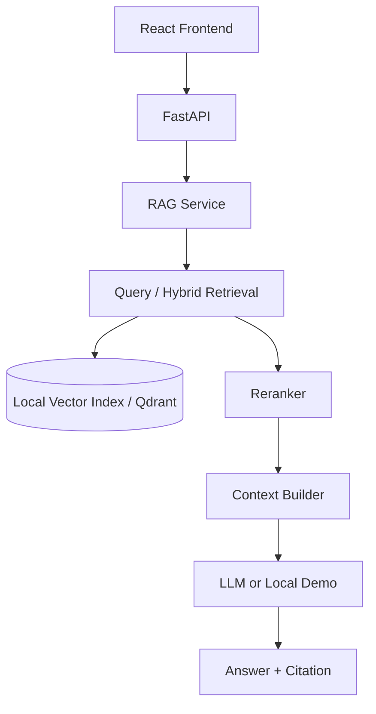

# RAG 求职知识库助手

一个可运行、可部署的 RAG Job Knowledge Assistant：上传求职与技术资料，进行带来源引用的问答、JD 分析、技能匹配和面试题生成。无外部 API Key 时自动使用本地确定性 embedding 与规则生成，便于本地演示和 CI；配置 OpenAI-compatible 服务后可替换为生产模型。

## 核心能力

- PDF / Markdown / TXT / DOCX 上传、解析、清洗和可配置切片
- Qdrant collection（不可用时自动回退本地索引）的向量 + 关键词混合检索、规则重排、来源引用和无答案拒答
- SQLite 文档元数据与对话历史；Qdrant 服务可由 Compose 启动并作为后续向量存储扩展点
- JD 结构化分析、技能匹配、面试题生成、20 条评测集和真实评测脚本
- React + Vite 三个页面：对话、知识库、JD 分析；FastAPI Swagger 自动文档

## 架构



## 目录

`backend/app` 按 API、schemas、services、rag、loaders、database 分层；`frontend/src` 按页面、组件和 API 客户端分层；`data/demo` 是可直接导入的演示资料。

## 本地运行

```bash
python -m venv .venv
# Windows: .venv\\Scripts\\activate | Linux/macOS: source .venv/bin/activate
pip install -r backend/requirements.txt
copy .env.example .env  # Linux/macOS 使用 cp
python scripts/init_demo_data.py
uvicorn backend.app.main:app --reload --port 8000
```

另开终端：

```bash
cd frontend
npm install
npm run dev
```

打开 <http://localhost:5173>，Swagger 在 <http://localhost:8000/docs>。

## Docker

```bash
copy .env.example .env
docker compose up -d --build
```

前端 `http://localhost:5173`，后端 `http://localhost:8000`，Qdrant `http://localhost:6333`。`data` 和 `qdrant_data` 均持久化。

## 环境变量

见 `.env.example`。`OPENAI_API_KEY`、`OPENAI_BASE_URL`、`LLM_MODEL` 用于 Chat Completion；`EMBEDDING_API_KEY`、`EMBEDDING_BASE_URL`、`EMBEDDING_MODEL` 用于独立的 OpenAI-compatible Embedding 服务。DeepSeek Chat API 不提供项目所需的 Embedding 接口；未配置独立 Embedding 服务时系统自动使用本地 embedding。`CHUNK_SIZE`、`CHUNK_OVERLAP`、`TOP_K`、`MAX_FILE_SIZE_MB` 控制本地 RAG 行为。

## API

| 方法 | 路径 | 说明 |
|---|---|---|
| GET | `/health` | 健康检查 |
| POST | `/api/v1/chat` | RAG 问答与 citations |
| POST | `/api/v1/documents/upload` | 上传并索引文档 |
| GET | `/api/v1/documents` | 文档列表 |
| GET/DELETE | `/api/v1/documents/{document_id}` | 文档详情/删除 |
| POST | `/api/v1/search` | 混合检索 |
| POST | `/api/v1/jobs/analyze` | JD 分析 |
| POST | `/api/v1/jobs/match` | 技能匹配 |
| POST | `/api/v1/jobs/interview-questions` | 面试题生成 |
| POST | `/api/v1/evaluation/run` | 评测 |

所有响应统一为 `{code, message, data}`，异常不会泄露内部堆栈或密钥。

## 测试与评测

```bash
cd backend && pytest -q
cd .. && python scripts/run_evaluation.py
```

评测脚本逐题执行真实检索，统计 retrieval hit rate、answer correctness（回答覆盖率代理指标）、citation correctness（来源元数据完整性）、无答案处理率和平均延迟；不硬编码结果。

## 设计难点与优化方向

文档解析要保留页码等 metadata；切片要平衡语义完整性和召回粒度；混合检索兼顾术语精确匹配与语义相似；rerank 和阈值控制减少幻觉；引用系统让结论可追溯。生产化时可将 `LocalVectorStore` 替换为 Qdrant client、将 `OpenAIEmbeddingService` 接入真实 embedding，并增加鉴权、异步任务队列、流式输出和更严格的离线评测。

## 简历描述

独立开发 RAG 求职知识库助手：基于 FastAPI/React 搭建文档上传、解析切片、Embedding、混合检索、重排、引用和拒答闭环；使用 SQLite 管理元数据与会话，提供 Qdrant Docker 部署、JD 结构化分析、技能匹配、面试题生成和可复现评测脚本。

## 面试问题方向

可围绕 chunk 策略、embedding 替换、混合检索融合、rerank、引用可信度、拒答阈值、Qdrant payload、Prompt 注入、延迟优化、评测集设计、Docker 持久化和 FastAPI 异常处理展开。

### 20 个面试问题与参考答案

1. RAG 的核心流程是什么？答：查询处理、切片、Embedding、混合召回、重排、上下文构造、生成和引用。
2. 为什么需要 chunk overlap？答：保留跨片段语义，降低边界截断造成的召回损失。
3. chunk size 如何选择？答：根据文档结构、问题粒度、上下文窗口和离线评测结果调优。
4. Embedding 表示什么？答：把文本映射到向量空间，使语义相近的文本距离更近。
5. 向量检索的优点是什么？答：能召回未共享关键词但语义相近的内容。
6. 关键词检索的优点是什么？答：对技术名词、版本号和精确事实更可靠。
7. 为什么要做 Hybrid Search？答：融合语义召回和精确匹配，降低单一检索的盲区。
8. Rerank 解决什么问题？答：在较大的候选集上用更精细的相关性模型重新排序。
9. Qdrant 中为什么保存 payload？答：保存文件名、页码和 chunk 元数据，以便过滤和生成引用。
10. 如何实现无答案拒答？答：设置相关性阈值，低于阈值返回固定拒答文本，不调用模型编造。
11. 如何验证引用正确性？答：检查引用的文档、chunk、页码与答案结论是否能在原文中定位。
12. 如何减少 Prompt Injection 风险？答：把检索内容视为数据，系统指令明确边界，并过滤不可信指令。
13. FastAPI 的 Pydantic 有什么作用？答：校验请求和响应结构，自动生成 OpenAPI 文档。
14. 如何处理大文件上传？答：白名单扩展名、大小上限、安全文件名和流式/异步处理。
15. 对话历史如何支持多轮？答：按 conversation_id 持久化消息，并对短追问做查询改写。
16. RAG 延迟主要来自哪里？答：Embedding、向量检索、重排和 LLM 网络调用；可并行和缓存。
17. 如何评测 RAG？答：分别评估召回命中、答案覆盖、引用完整性、拒答和端到端延迟。
18. 为什么需要本地 Demo 模式？答：没有 API Key 时仍能运行测试和演示，避免伪造外部调用。
19. Docker 中如何保证数据不丢？答：挂载 SQLite/data 目录和 Qdrant storage volume。
20. 生产环境还需要什么？答：鉴权、限流、异步队列、观测告警、真实 reranker 和更严格的安全审计。
